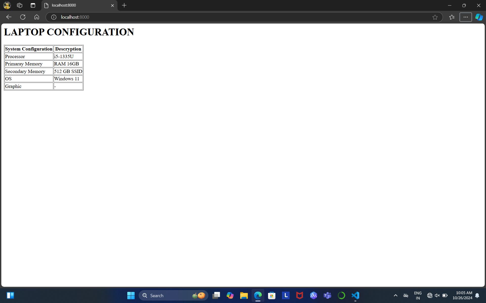

# EX01 Developing a Simple Webserver
## Date:
26/10/2024
## AIM:
To develop a simple webserver to serve html pages and display the configuration details of laptop.

## DESIGN STEPS:
### Step 1: 
HTML content creation.

### Step 2:
Design of webserver workflow.

### Step 3:
Implementation using Python code.

### Step 4:
Serving the HTML pages.

### Step 5:
Testing the webserver.

## PROGRAM:
'''
from http.server import HTTPServer,BaseHTTPRequestHandler

content='''
<html>
    <body>
        <h1> LAPTOP CONFIGURATION</h1>
    <table>
        <tr>
        <th> System Configuration</th>
        <th> Descryption</th>
        </tr>
        <TR>
            <td>Processor</td>
            <td>i5-1335U</td>   
        </TR>
        <tr>
            <td>Primaray Memory</td>
            <td>RAM 16GB</td>
        </tr>
        <tr>
            <td>Secondary Memory</td>
            <td>512 GB SSID</td>
        </tr>
        <tr>
            <td>OS</td>
            <td>Windows 11</td>
        </tr>
        <tr>
            <td>Graphic</td>
            <td></td>
        </tr>
    </table>
    </body>
</html>
'''

class MyServer(BaseHTTPRequestHandler):
    def do_GET(self):
        print("Get request received...")
        self.send_response(200) 
        self.send_header("content-type", "text/html")       
        self.end_headers()
        self.wfile.write(content.encode())

print("This is my webserver") 
server_address =('',8000)
httpd = HTTPServer(server_address,MyServer)
httpd.serve_forever()
## OUTPUT:

## RESULT:
The program for implementing simple webserver is executed successfully.
